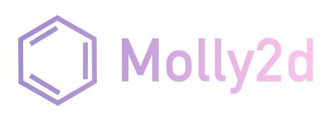

<div align="center"></div>

# molly2d

A löve-inspired 2d game framework that gets out of your way.

## Installation

Add this to your application's `shard.yml`:

```yaml
dependencies:
  molly2d:
    github: willamin/molly2d
```

## Usage

```crystal
require "molly2d"
```

TODO: Write usage instructions here

## Development

TODO: Write development instructions here

## Contributing

1. Fork it ( https://github.com/willamin/molly2d/fork )
2. Create your feature branch (git checkout -b my-new-feature)
3. Commit your changes (git commit -am 'Add some feature')
4. Push to the branch (git push origin my-new-feature)
5. Create a new Pull Request

## Contributors

- [[Willamin]](https://github.com/willamin) Will Lewis - creator, maintainer

## Roadmap
1. [x] drawing basic rectangles
2. [x] game loop timing
3. [x] drawing basic text
4. [x] checking keyboard state
5. [x] drawing background images
6. [x] drawing sprites
7. [ ] window state and properties
8. [x] playing sounds
  8a. [x] one-shot sounds
  8b. [x] background music
9. [ ] checking mouse state
10. [ ] checking gamepad state
